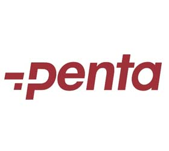

# ComProSearch: Multi-Source Product Comparison Tool

ComProSearch is a powerful product comparison engine designed to aggregate and display product data from multiple electronics distributors in Turkey. It provides a unified, fast, and feature-rich interface for searching, filtering, and comparing products from sources like Oksid, Penta (Bayinet), and Denge.



## ✨ Features

- **Multi-Source Aggregation**: Fetches and displays product data from several distributors in real-time.
- **Unified Search**: A single search bar to query across all available marketplaces.
- **Tabbed Navigation**: Easily switch between different data sources (Oksid, Penta, Denge).
- **Advanced Filtering & Sorting**: Filter products by category and sort by price.
- **Dynamic UI**: A modern, responsive interface built with React and Tailwind CSS, featuring smooth animations and conditional color themes for each distributor.
- **Real-time Data Updates**: See the last time the data for each marketplace was updated.
- **Scalable Architecture**: The backend is powered by Supabase, with data integration handled by modular Python scripts.

## 🛠️ Tech Stack

- **Frontend**:
  - **Framework**: React (with TypeScript)
  - **Build Tool**: Vite
  - **Styling**: Tailwind CSS with custom animations
  - **UI Components**: `lucide-react` for icons

- **Backend & Database**:
  - **Platform**: Supabase
  - **Database**: Supabase Postgres
  - **Serverless Functions**: Supabase Edge Functions (Deno) for potential backend logic.

- **Data Integration**:
  - **Language**: Python
  - **Libraries**: `supabase-client`, `pandas`, `requests`
  - **Functionality**: Individual scripts for each data source to fetch, process, and upload data to the Supabase database.

- **Deployment**:
  - **Frontend**: Netlify

## 📂 Project Structure

```
ComProSearch/
├── frontend/         # React/Vite frontend application
│   ├── src/
│   │   ├── components/ # Reusable React components
│   │   ├── services/   # Data fetching logic (products.ts)
│   │   └── lib/        # Supabase client initialization
│   └── vite.config.ts  # Vite configuration
│
├── scripts/          # Python scripts for data scraping/updating
│   ├── bayinet/
│   ├── denge/
│   └── oksid/
│
├── supabase/         # Supabase backend configuration
│   └── functions/      # Serverless edge functions
│
├── netlify.toml      # Netlify deployment configuration
└── README.md         # This file
```

## 🚀 Getting Started

Follow these instructions to set up and run the project locally.

### Prerequisites

- **Node.js**: v18.x or higher
- **Python**: v3.9 or higher
- **Git**: For cloning the repository
- **Supabase Account**: A free Supabase account to host the database.

### 1. Clone the Repository

```bash
git clone https://github.com/oguzyucel1/ComProSearch.git
cd ComProSearch
```

### 2. Supabase Setup

1.  Go to [Supabase](https://supabase.com/) and create a new project.
2.  Inside your project, go to the **SQL Editor** and create the necessary tables for each data source (e.g., `oksid_products`, `bayinet_products`, `denge_products`). The Python scripts in the `scripts/` directory can be used as a reference for the required table schemas.
3.  Go to **Project Settings > API**. You will need the **Project URL** and the **`anon` public key**.

### 3. Frontend Setup

1.  Navigate to the `frontend` directory:
    ```bash
    cd frontend
    ```
2.  Create a `.env.local` file and add your Supabase credentials:
    ```env
    VITE_SUPABASE_URL=YOUR_SUPABASE_PROJECT_URL
    VITE_SUPABASE_ANON_KEY=YOUR_SUPABASE_ANON_KEY
    ```
3.  Install the dependencies:
    ```bash
    npm install
    ```
4.  Run the development server:
    ```bash
    npm run dev
    ```
    The application should now be running on `http://localhost:5173`.

### 4. Data Scripts Setup

The Python scripts are responsible for populating your Supabase database.

1.  For each script directory (`scripts/bayinet`, `scripts/denge`, `scripts/oksid`), you need to set up the environment and install dependencies.
2.  Create a `.env` file inside the `scripts/shared/` directory (you may need to create this directory if it doesn't exist) with your Supabase credentials. This will be used by the Python Supabase client.
    ```env
    # In scripts/shared/.env
    SUPABASE_URL=YOUR_SUPABASE_PROJECT_URL
    SUPABASE_KEY=YOUR_SUPABASE_SERVICE_ROLE_KEY
    ```
    **Note**: For the scripts, use the **`service_role` key** from your Supabase API settings, as they need write access to the database.

3.  Install dependencies for each script. For example, for the `denge` script:
    ```bash
    cd scripts/denge
    pip install -r requirements.txt
    cd ../.. # Return to root
    ```
    Repeat this for `oksid` and `bayinet`.

4.  Run a script to update the data:
    ```bash
    python -m scripts.denge.update_denge
    ```

## 🚢 Deployment

The frontend is configured for deployment on **Netlify**.

1.  Push your code to a GitHub repository.
2.  Connect your repository to a new site on Netlify.
3.  Configure the build settings:
    - **Base directory**: `frontend`
    - **Build command**: `npm run build`
    - **Publish directory**: `frontend/dist`
4.  Add your Supabase environment variables (`VITE_SUPABASE_URL` and `VITE_SUPABASE_ANON_KEY`) to the Netlify site's environment variables.
5.  Deploy the site.

The `netlify.toml` file in the root directory contains the necessary redirect rules to ensure client-side routing works correctly.
